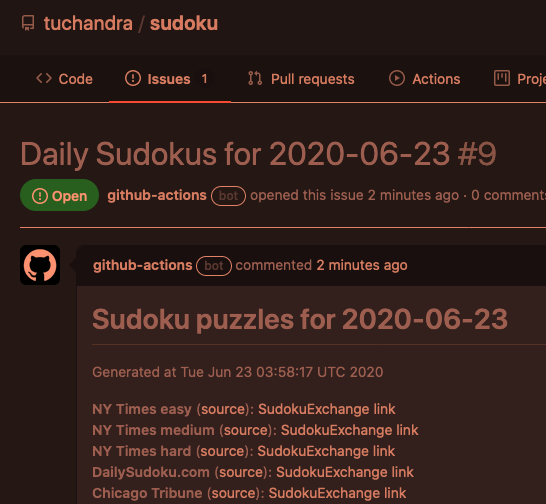

# CI-Doku
(using CI to get me Sudoku puzzles to solve daily)

## What is this?
I really love Sudoku puzzles; the New York Times publishes three difficulties each day, the LA Times publishes four, and a couple other sources publish daily puzzles too. Solving these is great, but a lot of websites' puzzle interfaces are lacking.

I recently discovered [SudokuExchange](https://sudokuexchange.com/), which has, in my opinion, the best interface for solving Sudoku puzzles online. I found myself manually entering puzzles from other places into SudokuExchange too often, so, like any engineer, I wrote code to do it for me.

## How did I do it?
I use two scrapers: one in Python, and one in Node. I started in Python because it's much more familiar to me, and the combination of [requests](https://requests.readthedocs.io/en/master/) + [beautifulsoup](https://www.crummy.com/software/BeautifulSoup/bs4/doc/) make common web scraping tasks easy. Sending GET requests and parsing the HTML worked great.

The LA Times puzzles, though, used a fair amount of obfuscated JavaScript that made it hard to run in Python; the puzzle was generated on the fly after the page loaded. I would have had to use something like Selenium to run a headless browser.

At this point, I decided it'd be easier to do this in JavaScript, and after some searching I found [Pupeteer](https://github.com/puppeteer/puppeteer) to run headless Chrome. The docs were excellent, and it was easy to get started, so I threw together a Node script and we were all set.

The last step was automating it all. I had wanted to learn more about CI for a while, so I set up a [Github Actions workflow](https://github.com/tuchandra/sudoku/actions) to run this a few times a day (accounting for the fact that different website posted their puzzles at different times). This took a *lot* of trial and error, but now I'm getting daily links to great Sudoku puzzles.

## Repo contents
This repo is pretty simple:
 * `sudoku.py` is the main Python script; it runs on Python 3.8 with dependencies in `requirements.txt` (it's just requests + beautifulsoup)
 * `index.js` is the main Node script; it runs on Node 14 with dependencies in `package.json` (it's just puppeteer)
 * `.github/workflows/main.yml` is the workflow configuration file

And that's all! Sometimes, the simplest projects are the most powerful.
